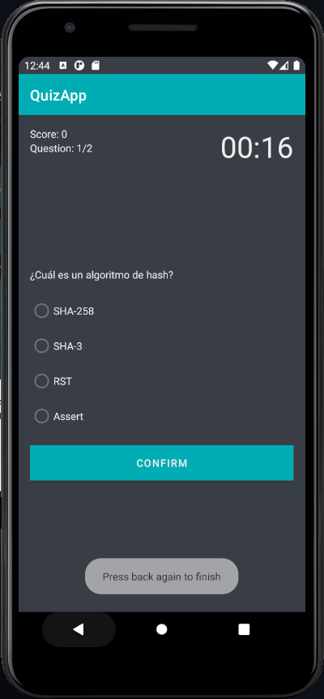
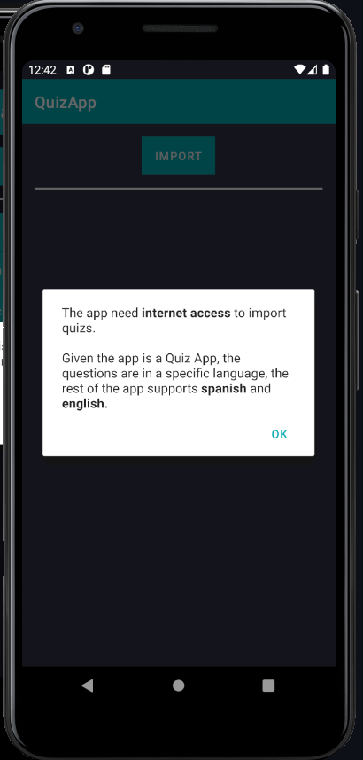
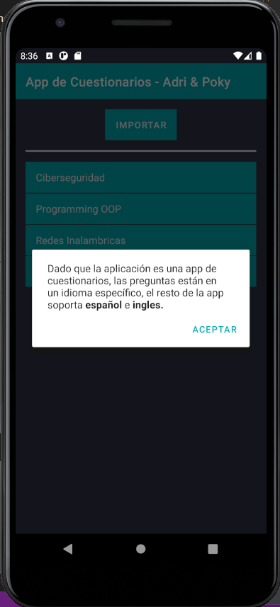
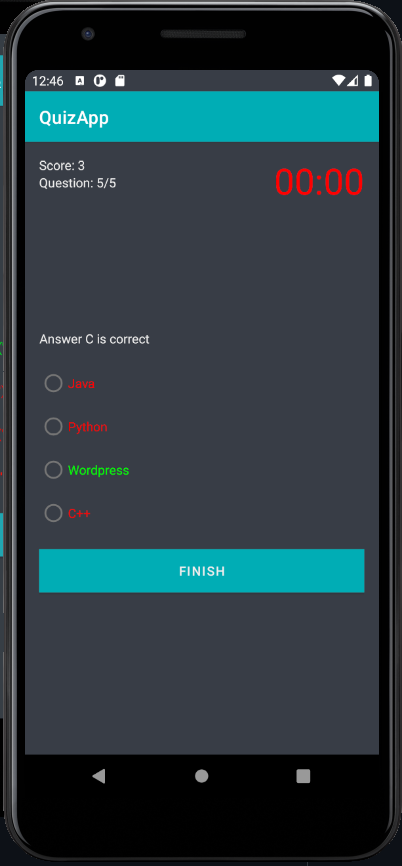
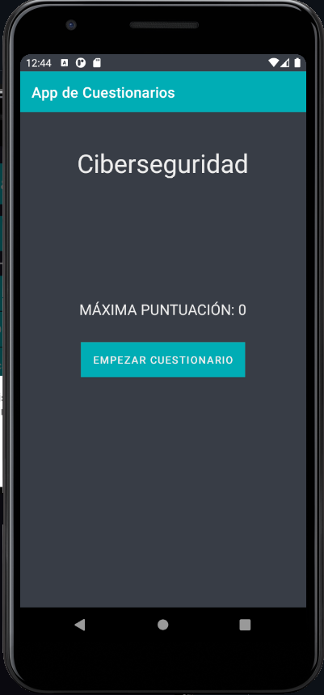

# How to run it

1. Open the project with Android Studio _(4.1.1)_
2. Activate Lombok Plugin
   1. Go to `File -> Settings -> Plugins` and search for Lombok
   2. Install Lombok
   3. Enable Lombok Annotations
      1. Go to `File -> Settings -> Languages & Frameworks -> Lombok plugin`
      2. Check "Enable Lombok plugin for this project"
3. Restart Android Studio

# Change language

The app supports spanish and english, change the language of your mobile phone to switch between them: `Settings -> System -> Languages & Input`

# Screenshots

